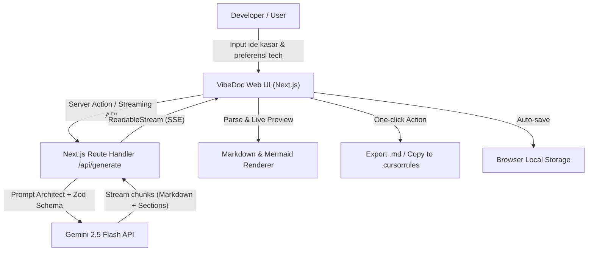

# Project Overview & Objective

Vibe coding memungkinkan developer membangun aplikasi dengan kecepatan tinggi menggunakan AI coding assistant (Cursor, Copilot, Antigravity, Windsurf). Namun, developer sering mengalami **context drift**, halusinasi AI, dan struktur kode yang berantakan karena instruksi awal yang ambigu dan ketiadaan dokumen acuan yang ringkas.

**VibeDoc** adalah aplikasi web dan tool developer yang mengubah ide produk mentah (1-2 paragraf) menjadi dokumen arsitektur dan panduan implementasi berbasis Markdown yang modular, padat konteks (*token-efficient*), dan langsung siap pakai sebagai acuan utama context window LLM.

- **Objective**: Memangkas waktu perencanaan teknis dari berjam-jam menjadi kurang dari 30 detik tanpa mengorbankan kualitas arsitektur software.
- **Core Value Proposition**: *"From raw vibe to rock-solid architecture in 30 seconds."* Menghasilkan dokumen Markdown terstruktur yang dioptimasi khusus untuk dipahami AI agent dan LLM coder.

---

## Architecture & Tech Stack

### Technology Stack
- **Frontend**: Next.js 15 (App Router), React 19, TypeScript
- **Styling & UI**: Tailwind CSS v4, shadcn/ui, Lucide Icons
- **AI Core & Streaming**: Google Gemini API (`@google/genai` SDK - Gemini 2.5 Flash) via Vercel AI SDK
- **Markdown & Diagram**: `react-markdown`, `rehype-highlight`, `mermaid.js` (client-side rendering)
- **Validation**: Zod (Schema validation & structured outputs)
- **Storage / Persistence (MVP)**: Local-first via Browser `localStorage` / IndexedDB (tanpa auth untuk gesekan minimal), opsional PostgreSQL via Prisma/Drizzle di fase lanjutan.
- **Deployment**: Vercel / Cloudflare Pages

### Architecture Flowchart



---

## Core Features & MVP Scope

### MVP Scope (Must-Have)
- [x] **Smart Prompt Form**: Form input sederhana untuk ide kasar proyek, target pengguna, dan preferensi stack (jika ada).
- [x] **AI Spec Generator (Streaming)**: Pembuatan dokumen 7-seksi otomatis secara real-time via streaming response.
- [x] **Live Dual-Pane Preview**: Split view antara form/editor dan hasil Markdown render lengkap dengan diagram Mermaid interaktif.
- [x] **Token & Context Counter**: Indikator perkiraan token dokumen agar developer tahu seberapa ramah dokumen terhadap context window AI.
- [x] **Modular Copy & Export**:
  - Copy whole document.
  - Copy specific sections (misal: hanya Database Schema atau API Spec).
  - Download langsung sebagai `PRD.md` atau `ARCHITECTURE.md`.
- [x] **Local Session History**: Menyimpan riwayat proyek yang di-generate langsung di browser tanpa perlu registrasi akun.

### Post-MVP (Nice-to-Have)
- [ ] **AI Refine & Section Edit**: Fitur chat inline untuk merevisi seksi tertentu (misal: "Ganti database ke Supabase dan tambahkan auth Google").
- [ ] **Preset Direct Export**: Export langsung ke format `.cursorrules`, `.windsurfrules`, atau `AGENTS.md`.
- [ ] **GitHub Scaffolding**: Tombol untuk generate boilerplate repository via GitHub API.
- [ ] **Cloud Workspace & Sync**: Autentikasi user dan penyimpanan cloud berbasis PostgreSQL.

---

## Database Schema / Data Structure

Untuk tahap MVP, VibeDoc menggunakan struktur data lokal (*local-first*). Jika dihubungkan ke database relasional (PostgreSQL/SQLite via Prisma), skema entitasnya adalah sebagai berikut:

```prisma
datasource db {
  provider = "postgresql"
  url      = env("DATABASE_URL")
}

generator client {
  provider = "prisma-client-js"
}

model Project {
  id          String     @id @default(cuid())
  title       String
  slug        String     @unique
  rawPrompt   String     @db.Text
  targetStack String?
  createdAt   DateTime   @default(now())
  updatedAt   DateTime   @updatedAt
  documents   Document[]

  @@map("projects")
}

model Document {
  id          String   @id @default(cuid())
  projectId   String
  project     Project  @relation(fields: [projectId], references: [id], onDelete: Cascade)
  contentMd   String   @db.Text
  tokenCount  Int      @default(0)
  version     Int      @default(1)
  createdAt   DateTime @default(now())

  @@map("documents")
}

model Template {
  id          String   @id @default(cuid())
  name        String
  description String
  systemPrompt String  @db.Text
  isDefault   Boolean  @default(false)

  @@map("templates")
}
```

### TypeScript Local Model (Frontend MVP State)
```typescript
export interface GeneratedDoc {
  id: string;
  title: string;
  rawInput: string;
  markdown: string;
  tokenCount: number;
  createdAt: number;
}
```

---

## API Spec & Key Workflows

### 1. `POST /api/generate`
Endpoint streaming untuk men-generate dokumen spesifikasi proyek secara progresif.

- **Request Body**:
```json
{
  "idea": "Aplikasi bookmark AI yang otomatis merangkum isi artikel web",
  "techPreferences": "Next.js, Supabase, Tailwind, Gemini API",
  "targetAudience": "Content creator & researcher"
}
```

- **Response**: `ReadableStream` (Server-Sent Events / Text Stream).
- **Status Codes**:
  - `200 OK`: Stream dimulai.
  - `400 Bad Request`: Input kosong atau melewati batas karakter.
  - `500 Internal Server Error`: Kegagalan pada koneksi AI provider.

### 2. `POST /api/tokenize`
Menghitung estimasi token Markdown untuk context budget LLM.

- **Request Body**: `{ "text": string }`
- **Response**: `{ "tokenCount": number, "charCount": number }`

### Key Workflow: User Interaction Flow
1. User mengisi deskripsi singkat proyek pada form input.
2. Client mengirim payload ke `/api/generate`.
3. Server memanggil Gemini 2.5 Flash menggunakan prompt arsitek terstandarisasi.
4. Token ditransmisikan secara streaming ke client.
5. Client secara dinamis merender Markdown, syntax highlighting, dan diagram Mermaid.
6. User menyalin dokumen atau mengunduhnya sebagai `README.md` / `PRD.md` untuk langsung dimasukkan ke AI IDE.

---

## Step-by-Step Implementation Guide

### Phase 1: Setup Proyek & Baseline UI
- [ ] Initialize repository Next.js 15 dengan TypeScript dan Tailwind CSS:
  ```bash
  npx create-next-app@latest vibedoc --typescript --tailwind --app --src-dir --import-alias "@/*"
  ```
- [ ] Install shadcn/ui dan komponen dasar:
  ```bash
  npx shadcn@latest init
  npx shadcn@latest add button textarea card input badge tabs tooltip dropdown-menu
  ```
- [ ] Install dependency pendukung:
  ```bash
  npm install lucide-react react-markdown rehype-highlight remark-gfm mermaid zod @google/genai ai
  ```

### Phase 2: AI Prompt Engineering & API Route
- [ ] Buat file konfigurasi prompt di `src/lib/prompts/architect-prompt.ts`.
- [ ] Buat API Route `src/app/api/generate/route.ts` dengan Edge runtime & Gemini API client.
- [ ] Pasang Zod schema validation untuk memastikan request payload valid.
- [ ] Implementasikan streaming response handler di frontend dengan hook `useCompletion` atau custom `fetch` reader.

### Phase 3: Previewer & Mermaid Integration
- [ ] Buat komponen `MarkdownPreview.tsx` menggunakan `react-markdown` dan `rehype-highlight`.
- [ ] Buat wrapper komponen `MermaidRenderer.tsx` untuk render diagram secara dinamis di client.
- [ ] Tambahkan kalkulator estimasi token sederhana di utilitas `src/lib/token-counter.ts`.

### Phase 4: Fitur Ekspor & Manajemen State Lokal
- [ ] Buat store atau hook `useProjectHistory` berbasis `localStorage`.
- [ ] Tambahkan utilitas copy-to-clipboard dengan visual feedback toast.
- [ ] Tambahkan tombol download file `.md` langsung dari browser.

### Phase 5: Polish & Deployment
- [ ] Tambahkan dark/light mode toggle.
- [ ] Uji responsivitas pada perangkat desktop dan mobile.
- [ ] Setup env variable `GEMINI_API_KEY` di Vercel dan deploy ke production.

---

## Conventions & Guidelines

### Recommended Folder Structure
```
vibedoc/
├── src/
│   ├── app/
│   │   ├── api/
│   │   │   └── generate/
│   │   │       └── route.ts
│   │   ├── layout.tsx
│   │   ├── page.tsx
│   │   └── globals.css
│   ├── components/
│   │   ├── ui/               # shadcn UI components
│   │   ├── DocumentView.tsx  # Viewer dokumen render
│   │   ├── MermaidBlock.tsx  # Dynamic Mermaid renderer
│   │   ├── PromptInput.tsx   # Form input ide proyek
│   │   └── TopBar.tsx        # Navigasi & aksi ekspor
│   ├── hooks/
│   │   ├── useLocalStorage.ts
│   │   └── useVibeGenerator.ts
│   ├── lib/
│   │   ├── gemini.ts         # Client instance Gemini SDK
│   │   ├── prompts/          # System prompt template
│   │   └── utils.ts          # Helper fungsi umum
│   └── types/
│       └── document.ts       # TypeScript interfaces
├── public/
├── .env.local
├── package.json
└── tsconfig.json
```

### Naming Conventions
- **Files & Folders**: `kebab-case` untuk folder dan file helper (misal: `token-counter.ts`), `PascalCase` untuk komponen React (misal: `MarkdownPreview.tsx`).
- **Variables & Functions**: `camelCase` (misal: `generateArchitectureDoc`, `isStreaming`).
- **Constants**: `UPPER_SNAKE_CASE` (misal: `DEFAULT_SYSTEM_PROMPT`).
- **Types & Interfaces**: `PascalCase` tanpa prefix `I` (misal: `ProjectConfig`, `SectionMeta`).

### Error Handling & Edge Cases
- **API Failures**: Server Action / Route Handler harus mengembalikan format error standar:
  ```typescript
  return Response.json(
    { success: false, error: "RATE_LIMIT_EXCEEDED", message: "API limit tercapai, coba beberapa detik lagi." },
    { status: 429 }
  );
  ```
- **Mermaid Render Error**: Jika syntax diagram hasil AI ada yang salah, tangani di blok `try/catch` client-side dan tampilkan fallback dalam bentuk raw code block, bukan membuat seluruh UI crash.
- **Client Sanitization**: Gunakan `rehype-sanitize` bila dokumen mengizinkan tag HTML untuk mencegah eksekusi skrip berbahaya.
